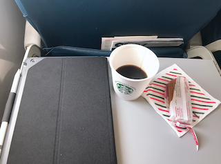
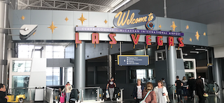
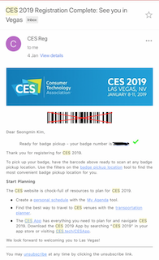

# Day01 (2019.01.08, TUE)
## Tour Day

### Departure the from SAN to LAS at 10:31 AM

  
   
  

### Arrival at LAS(Las Vegas McCarran International Airport) from SAN(San Diego International Airport) at Noon

### Getting the My CES badge at LVCC(Las Vegas Convention Center)

  
   

### After showing barcode about CES registration and your ID(Passport or driver lincence in US), I can get the my CES badge

### Because I didn't know about Las Vegas and CES Tech Center, I just look around Las Vegas Strip.

  
   
   

  
   
   

  
   
   

