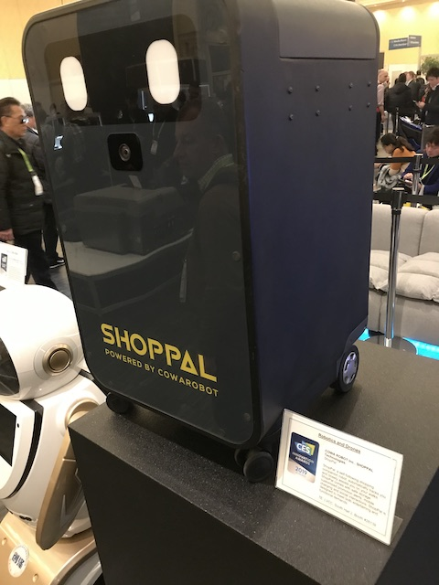
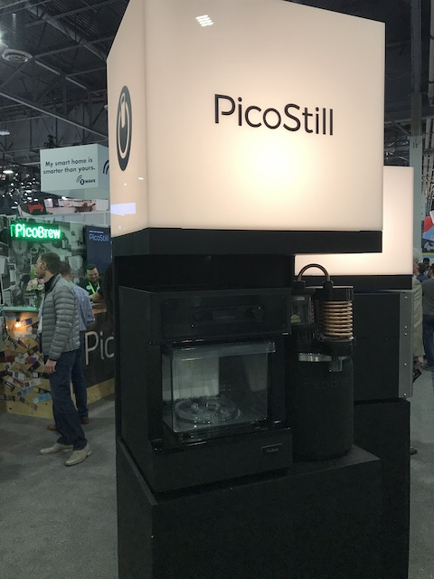
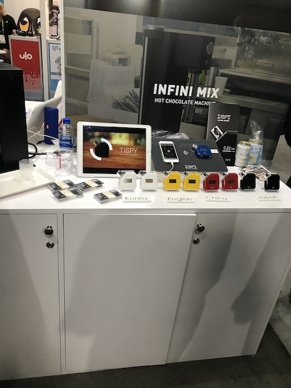
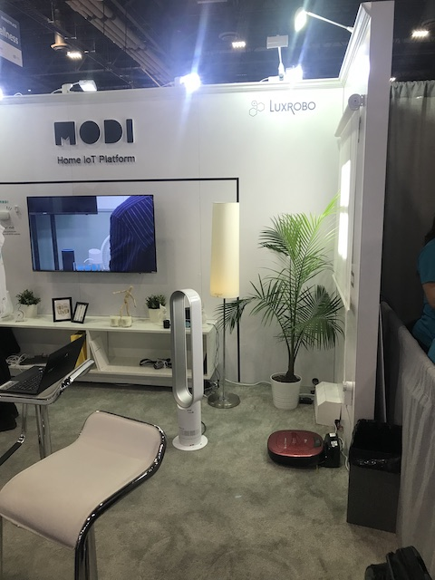
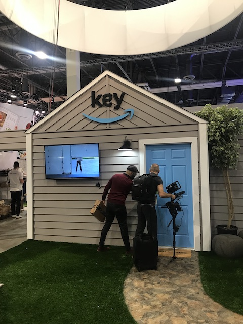

# Day02 (2019.01.09, WED)
## AMD keynote ,Asian, University, Start up in Tech West(Sans Expo) 

## AMD Keynote
### AMD Keynote starts at 9:00 AM in the Tech West(Sands Expo) Palazzo Ballroom.

### The World's First 7nm GPU, Radeon Instinct Vega.

AMD President and CEO, Dr.Lisa Su provides a view into the diverse applications for new computing technologies ranging from solving some of the world’s toughest challenges to the future of gaming, entertainment and virtual reality with the potential to redefine modern life. AMD is catapulting computing, gaming, and visualization technologies forward with the world’s first 7nm high-performance CPUs and GPUs, providing the power required to reach technology’s next horizon. 
<strong> You Tube Link </strong>
https://www.youtube.com/watch?v=bibZyMjY2K4

  
   

  
   

### AMD Reward (Tom Clancy’s The Division® 2 -> FPS Game???)

  
   

  
  
    

### After attending the keynote

<strong>Before the AMD keynote, I watched You Tube videos like Steve Jobs or Tim Cook's Apple keynote. 
So this is the first keynote to attend.  
But, it was very different from You Tube. 
It was a very good experience for me. I felt real technology and passion of the attendees. 
Also I really respected the presenter. 
From my point of view, I felt she was proficient in English. And I was deeply impressed that she was proud of her company. (AMD products) 
Thanks to these keynote, I got a bucket list in my life.  
If I become the team leader in the future, I'd like to feel the joy of explaining our team's technology and products proudly in front of a large audience. like I watched it.  </strong>

## Below devices are almost made by start up company

 

    Eureka Park has many starts up company with new technologies. 
    CES_Best_Product is the place where has a collection of 2019 CES Innovation Awards.

## Smart Device
###  ShopPal (made by COWA ROBOT, Inc) [Robotics and Drones]
ShopPal a self following shopping companion robot automatically tracks you and closely assists you on your walks ShopPal comes with safe storage customized promotion alerts mobile charging and social interactions ShopPal is designed to meet both entertaining and functional demands. 
  

### Archer AX11000 802.11ax Wi-Fi Router(made by TP-Link USA corp) [Gaming]
Archer AX11000 is TP-Link's 802.11ax gaming router and Tri-Band that takes WiFi speed to a whole new level 11000Mbps. It's the world's fastest gaming router. 
 

### Wizama board game console (made by Wizama) [Gaming]
Wizama creates a new entertainment screen, a console featuring built-in touch screen and its own controllers : pawns, cards, dice and dice track to enable both physical and digital interaction. It merges traditional board games and video games through patented technologies. 

### HyperCharger XX : Ultimate 8-in-1 Wireless Powerbank (made by LinearFlux USA Inc ) and COSMO COMMUNICATOR (made by PLANET COMPUTERS LTD) [Wireless Devices, Accessories and Services]
HyperCharger XX : Ultimate 8-in-1 Wireless Powerbank: World's Ultimate High-Power, 15-Watt Wireless & Wired Powerbank for car, home, and travel. Unique latching system, that work like magic, stays attached to your Qi-Wireless smartphone until charging is FULLY completed. 
Charges up to 3 devices at once.  

COSMO COMMUNICATOR: Planet Computers introduces the COSMO PDA Smartphone. COSMO provides the ultimate mix of high-end phone, pocket computer & camera functions. With its dual screens (internal and external), a 20MP camera and backlit keyboard. the COSMO is the ultimate all-in-one device for creating on the move. 
 

### LARQ Bottle (made by LARQ) [Sustainability and Eco-Design]
The LARQ Bottle makes it possible for consumers to drink confidently anywhere, providing instant water purification in a self-cleaning bottle by utilizing proprietary UV-C LED technology that emits UV-C light in the 280 nm range. 

### Beko Sardis Payment Terminal (made by Token Finansal Teknoloji A.S. Turkey )  [Cybersecurity and Personal Privacy]
Beko Sardis, is the next generation payment terminal form TOKEN that secures all payment transactions by bringing high level retail experience to everyday merchants. The revolutionary UI in complete harmony with the industrial design results user experience. 

### Hercules DJControl Inpulse 300 (made by Hercules is a division of Guillemot Corporation S.A. France)  [Home Audio/Video Components and Accessories]
The Hercules DJControl Inpulse 300 combines DJ mixing software and an innovative DJ controller with built-in light guides to help aspriring DJs learn how to perfect the art of manual beat-matching and choose the right songs for a seamless music mix. 

### The zSpace Laptop (made by zSpace) [Virtual and Augmented Reality]
The zSpace Laptop is the world's first extended reality(XR) labtop that allows students to lift virtual simulations from the screen using a stylus and examine them in detail - enabling a deeper understanding of STEM curriculum. 

### Meshroom Studio Pro (made by Meshroom VR) [ Software and Mobile Apps]
Meshrooms Studio Pro is the most simple and easy to use Virtual Reality software for 1:1 scale 3D project validation. Our solution allows to save time and costs by avoiding numerous physical prototypes. It is so easy to use that everyone in the company can work them it: from designer to sales teams. 

### Chippolo Dot (made by Chippolo)
Chipolo's new Bluetooth tracker with a louder melody, extended battery life and an LED light for those dark spots

### PROTECTIONNECT (made by PROTECTO) [Sustainability and Eco-Design]
The smart cover PROTECTIONNECT protecs and insuates water meters against freezing to   (-11.2°F − 32) × 5/9 = -24°C ans is fitted with connected technology controlled with a mobile application that allow a real-time monitoring and water leaks detection whenever it occured in housing. 

### Smart Juicer (made by Kuvings)  and SmartButton

 

### PicoStill and PicoBrew (made by PicoBrew)
Meet PicoStill, our new distilling attachment. Affordable, quality design elevates creaft brewing for professional distillers(증류기) and homebrewers alike. 
Distill(증류하다) pilot batches of spirits safely and more precisely, or use PicoStill to capture the essence of hops (홉의 본질)and other oils and imbue(채우다) food and beverages with unique flavors and aromas. 

 

### TISPY alcohol gadget (made by INFINI MIX HOT CHOCOLATE MACHINE) [Japanese Company]
It's a handy alcohol detector. It supports the languages (Japan, Korea, China, English). It is used for checking person's health using mobile app. 

## Wearable / Health Care
### E-vone (Made by E-vone France Company) [Tech For A Better World]
E-vone is a fashionable connected shoe designed for the baby boomers that can detect falls and automatically alert caregives.  
It is embedded technology with AI (Sensor = Acceererometer gyroscope, GPS = Location, Battery, LoRa & NBIoT = Antena).

### Cleer ALLY Plus (made by Cleer, Inc) [Fitness, Sports and Biotech]
The ALLY Plus True Wireless Headphone, designed to work with voice interface, delivers listening freedom with robust audio straming, active noise canceling, enhanced communications, IPX5 water resistance, and up-to 10 hour playback enabled by a Qualcomm QCC5124 SoC. 

### 1MORE Triple Driver BT In-Ear Headphones, 1MORE Spearhead VR BT In-Ear Headphones, 1MORE Penta Driver In-Ear Headphones
(made by 1MORE) [Headphones]
- 1MORE's Triple Driver BT In-Ear Headphones feature a patented hybrid acoustic triple driver design and a high-resolution LDAC + AAC Bluetooth codec that provides a lossless, audiophile(오디오 애호가)-grade wireless experience without affecting sound quality. 
- 1MORE's Spearhead VR BT In-Ear Headphones feature a dual-dynamic driver in a patented hybrid acoustic design with low latency Bluetooth v4.2 and ENC technology for real-time sound reproduction and a revolutionary mobile gaming experience. 
- The penta Driver In-Ear Headphones are the newest flagship model of 1MORE's award-winning headphone line, featuring 5 balanced armatures for an extremely intimate listening experience with lower distortion and abundant details. 

### WT2 Plus Real-time Earphone Translator (made by Shenzhen Timekettle Technologies Co, Ltd.)
WT2 Plus introduces the first "1+2" AI-powered translation system (1 App controls 2 Earphones) in the world. By integrating industry-leading voice alogrithm and machine translation technology. WT2 Plus delivers hands-free and natural communication experience in foreign languages.  

### Quell 2.0
Introducing Quell 2.0. 100% drug free, wearable technology that can help relieve chronic pain.
Quell is 100% drug free, and delivers prescription strength pain blocking technology. It’s FDA cleared and designed for people with multiple types and sources of chronic pain. You do not have to wear Quell on the area you are experiencing pain. Nerve stimulation can produce a widespread response that blocks pain signals beyond the site of application. Activate the power Inside You to relieve chronic pain.

 

### AURAI
6 minutes a whole New Horizon. (The World's First Water-Propelled Eye Massager with Cool and Warm Compress)

### Motion Pillow (made by 10minds)

### Dreamwear Mask System(made by Philips)

### HiiGa One  (made by janpan company)

## Smart Home
### EyecloudCam AI-on-edge true wireless smart camera (made by Eyecloud, Inc.) [Smart Home]
Our mission: Better lives with smart eyes. 
EyecloudCam is the first security camera in the world that offers free AI-on-device. powered by rechargeable batteries, and with encrypted(암호화된) local storage. The AI-on-device technology helps to detect human and strangers, reduce false alarms, and conserve power, while the wire-free design makes it easy to install and record even wiring power outage. 
### nRF91 Series multimode LTE-M/NB-IoT System-in-Package (made by Nordic Semiconductor ASA) [Embedded Technologies]  
Nordic's nRF91 Series is an ultra-compact, low power, global, multimode LTE-M/NB-IoT System-in-Package with integrated Arm Cortex-M33 host processor, Arm TrustZone security and Assisted GPS. The SiP integrates a complete low power cellular IoT system into a tiny 10x16x1.2 mm package.

### Norm Glasses (made by Human Capable Inc.) [Digital Imaging/Photography]
Using Norm Glasses, the user can see instructions while keeping hands busy on work, see and respond to text messages, answer or make phone calls, navigate while keeping eyes on the street, check stock prices, call an Uber, etc. For the editions equipped with a camera, it can also scan barcodes, take pictures, or record videos. It supports live streaming/broadcast, and remote assistance.  
### MY SAFE PATROL (made by My SAFE PATROL) [Smart Cities]
My SAFE PATROL is a AI powered security platform combining guard management tool, real-time alerting system for citizens and dynamic dashboard for security managers. 
### Blue Smart mia2(made by BlueSmart Technology)
BlueSmart mia2 is an Intelligent Baby Feeding Monitor that allows  
Keeping track of all your baby’s feedings manually is complicated and time-consuming, but using BlueSmart mia2 couldn’t be simpler.  
Step 1: Before Feeding  
Insert your baby bottle into BlueSmart mia2 and let it rest on a hard, flat surface until the ‘portion measured’ indicator lights up green. The Tricolor Bottle indicator will alert you if the temperature of the milk or formula is optimal or not.  
Step 2: Feeding  
If the ‘portion measured’ indicator is lit, you may pick up BlueSmart mia2 with bottle and feed your baby. To avoid distracting the baby while feeding, the indicators will only light up if the feeding angle is too steep, or the temperature is too hot.  
Step 3: After Feeding  
Put BlueSmart mia2 with bottle back onto a hard, flat surface and the feeding will be recorded automatically. Open the app on your Bluetooth-paired device, and you will find all of your baby’s feeding details. 

### Owlet App (made by Owlet Baby Care) [Software and Mobile Apps]
The Owlet App tracks baby's heart rate, oxygen levels, and sleep, so parents can hear, see, and know baby is okay. Its secure, encrypted connection to Wi-Fi provides parents privacy. With two-way audio, parents can talk to and listen to baby. Wellness insights include heart rate and sleep trends. 

### Coral One Vacumm Robot (made by Coral Robots, Inc.) [Rototics and Drones]
The Coral One is the world's first 2-in-1 vacumm robot and cyclonic handheld vacuum. Robotic vacuums haven't changed much in the last 20 years, so we sat down with people and designed something for the way they actually clean robot for the everyday, handheld for the here and there. 

### Ping (An Independent Living Service) (made by Leeo, Inc) [Accessibility]
A sensor enabled service to assist our older generation live independently with less impact on society. It provides status and notification to a private mutual aid network of friends and family of each other's Environmental. Presence and Activity quality without the stigma of other solutions. 

### Zmoda

### MODI (Korea Company)
Luxrobo MODI Hello IoT Kit (Interactive Smart Block) and Coding Toys Making Pack Set

### Digital Shower System With KOHLER. Konnect
Voice-activited on/off operation and Synchronized steam, water, light and music and Personalized settings. 

### GT Wonder Unlock the intelligence Boy
The Gt wonder bot is a personal assitant Ai powered bot that serves as a pal also to anyone with it's smart interactive system and vast knowledge of the web, user can interact with it, it schedules your day and acts as a reminder to each appointment, can be used as a hand free camera and most of all can sing and dance  

### Amazon Key
Amazon key lets delivery people inside your home
Amazon will soon be letting delivery drivers leave packages inside your front door, without a key, but with your permission.
Beginning in November 2017, Amazon will launch "Amazon Key" to prime members in 37 U.S. cities.  
First, users will need to buy a cloud cam camera and a WiFi connected smart lock starting at $249. Then select in-home delivery on the Amazon app. That will allow delivery people to drop off your packages right inside your door when you're not home.  

## University / Korea start up company

