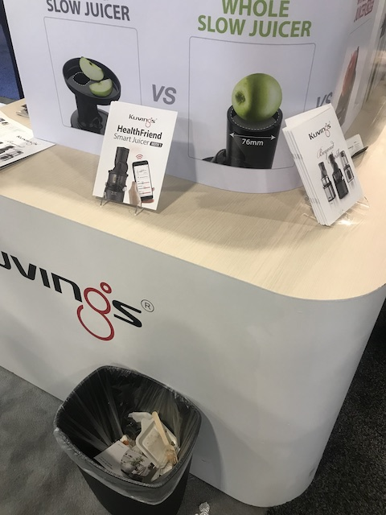

# Day02 (2019.01.09, WED)
## AMD keynote ,Asian, University, Start up in Tech West(Sans Expo) 

## AMD Keynote
### AMD Keynote starts at 9:00 AM in the Tech West(Sands Expo) Palazzo Ballroom.

### The World's First 7nm GPU, Radeon Instinct Vega.

AMD President and CEO, Dr.Lisa Su provides a view into the diverse applications for new computing technologies ranging from solving some of the world’s toughest challenges to the future of gaming, entertainment and virtual reality with the potential to redefine modern life. AMD is catapulting computing, gaming, and visualization technologies forward with the world’s first 7nm high-performance CPUs and GPUs, providing the power required to reach technology’s next horizon. 
<strong> You Tube Link </strong>
https://www.youtube.com/watch?v=bibZyMjY2K4

  
   

  
   

### AMD Reward (Tom Clancy’s The Division® 2 -> FPS Game???)

  
   

  
  
    

### After attending the keynote

<strong>Before the AMD keynote, I watched You Tube videos like Steve Jobs or Tim Cook's Apple keynote. 
So this is the first keynote to attend.  
But, it was very different from You Tube. 
It was a very good experience for me. I felt real technology and passion of the attendees. 
Also I really respected the presenter. 
From my point of view, I felt she was proficient in English. And I was deeply impressed that she was proud of her company. (AMD products) 
Thanks to these keynote, I got a bucket list in my life.  
If I become the team leader in the future, I'd like to feel the joy of explaining our team's technology and products proudly in front of a large audience. like I watched it.  </strong>

## Below devices are almost made by start up company

 
    Eureka Park has many starts up company with new technologies.

    CES_Best_Product is the place where has a collection of 2019 CES Innovation Awards.

## Smart Device
###  ShopPal (made by COWA ROBOT, Inc) [Robotics and Drones]
ShopPal a self following shopping companion robot automatically tracks you and closely assists you on your walks ShopPal comes with safe storage customized promotion alerts mobile charging and social interactions ShopPal is designed to meet both entertaining and functional demands.
  

### Archer AX11000 802.11ax Wi-Fi Router(made by TP-Link USA corp) [Gaming]
Archer AX11000 is TP-Link's 802.11ax gaming router and Tri-Band that takes WiFi speed to a whole new level 11000Mbps. It's the world's fastest gaming router.
 

### Wizama board game console (made by Wizama) [Gaming]
Wizama creates a new entertainment screen, a console featuring built-in touch screen and its own controllers : pawns, cards, dice and dice track to enable both physical and digital interaction. It merges traditional board games and video games through patented technologies.

### HyperCharger XX : Ultimate 8-in-1 Wireless Powerbank (made by LinearFlux USA Inc ) and COSMO COMMUNICATOR (made by PLANET COMPUTERS LTD) [Wireless Devices, Accessories and Services]
HyperCharger XX : Ultimate 8-in-1 Wireless Powerbank: World's Ultimate High-Power, 15-Watt Wireless & Wired Powerbank for car, home, and travel. Unique latching system, that work like magic, stays attached to your Qi-Wireless smartphone until charging is FULLY completed.
Charges up to 3 devices at once.  

COSMO COMMUNICATOR: Planet Computers introduces the COSMO PDA Smartphone. COSMO provides the ultimate mix of high-end phone, pocket computer & camera functions. With its dual screens (internal and external), a 20MP camera and backlit keyboard. the COSMO is the ultimate all-in-one device for creating on the move.
 

### LARQ Bottle (made by LARQ) [Sustainability and Eco-Design]
The LARQ Bottle makes it possible for consumers to drink confidently anywhere, providing instant water purification in a self-cleaning bottle by utilizing proprietary UV-C LED technology that emits UV-C light in the 280 nm range.

### Beko Sardis Payment Terminal (made by Token Finansal Teknoloji A.S. Turkey )  [Cybersecurity and Personal Privacy]
Beko Sardis, is the next generation payment terminal form TOKEN that secures all payment transactions by bringing high level retail experience to everyday merchants. The revolutionary UI in complete harmony with the industrial design results user experience.

### Hercules DJControl Inpulse 300 (made by Hercules is a division of Guillemot Corporation S.A. France)  [Home Audio/Video Components and Accessories]
The Hercules DJControl Inpulse 300 combines DJ mixing software and an innovative DJ controller with built-in light guides to help aspriring DJs learn how to perfect the art of manual beat-matching and choose the right songs for a seamless music mix.

### The zSpace Laptop (made by zSpace) [Virtual and Augmented Reality]
The zSpace Laptop is the world's first extended reality(XR) labtop that allows students to lift virtual simulations from the screen using a stylus and examine them in detail - enabling a deeper understanding of STEM curriculum.

### Meshroom Studio Pro (made by Meshroom VR) [ Software and Mobile Apps]
Meshrooms Studio Pro is the most simple and easy to use Virtual Reality software for 1:1 scale 3D project validation. Our solution allows to save time and costs by avoiding numerous physical prototypes. It is so easy to use that everyone in the company can work them it: from designer to sales teams.

### Chippolo Dot (made by Chippolo)
Chipolo's new Bluetooth tracker with a louder melody, extended battery life and an LED light for those dark spots

### PROTECTIONNECT (made by PROTECTO) [Sustainability and Eco-Design]
The smart cover PROTECTIONNECT protecs and insuates water meters against freezing to   (-11.2°F − 32) × 5/9 = -24°C ans is fitted with connected technology controlled with a mobile application that allow a real-time monitoring and water leaks detection whenever it occured in housing.

### Smart Juicer (made by Kuvings) 

### PicoStill and PicoBrew (made by PicoBrew)
Meet PicoStill, our new distilling attachment. Affordable, quality design elevates creaft brewing for professional distillers(증류기) and homebrewers alike.
Distill(증류하다) pilot batches of spirits safely and more precisely, or use PicoStill to capture the essence of hops (홉의 본질)and other oils and imbue(채우다) food and beverages with unique flavors and aromas.

 

### TISPY alcohol gadget (made by INFINI MIX HOT CHOCOLATE MACHINE) [Japanese Company]
It's a handy alcohol detector. It supports the languages (Japan, Korea, China, English). It is used for checking person's health using mobile app.

## Wearable / Health Care

## Smart Home

## University / Korea start up company

