# Day03 (2019.01.10, THU)

## LG (Innovation for a better life)
### LG Electronics CES-2019 Keynote
Link: http://live.ces.tech/detail/videos/robotics-machine-intelligence/video/5986976762001/lg-keynote?autoStart=true

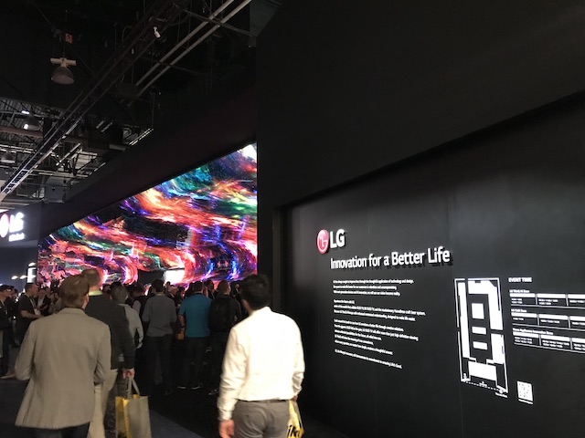 
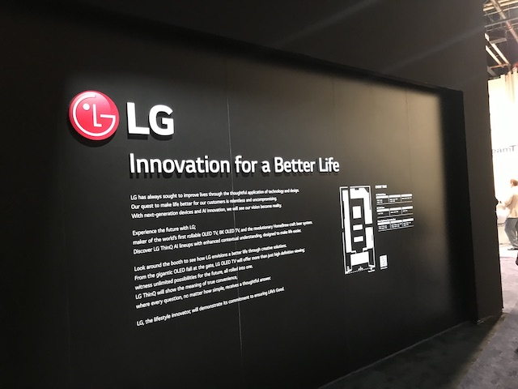 

### Appliances

- Rollable TV

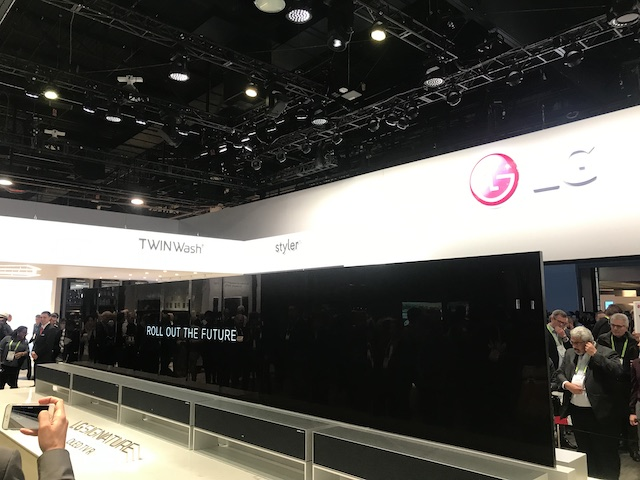 
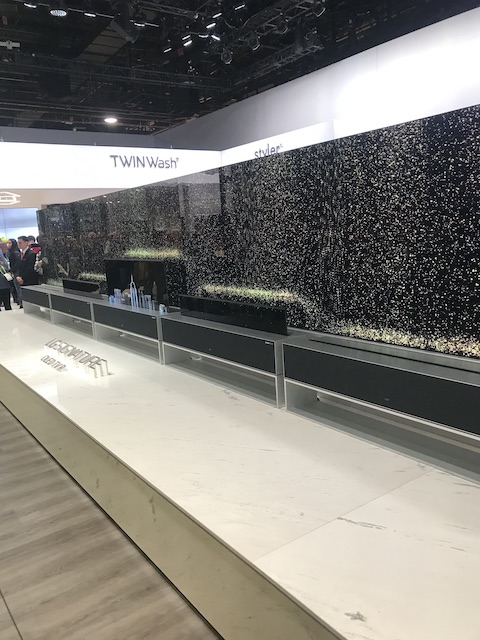 
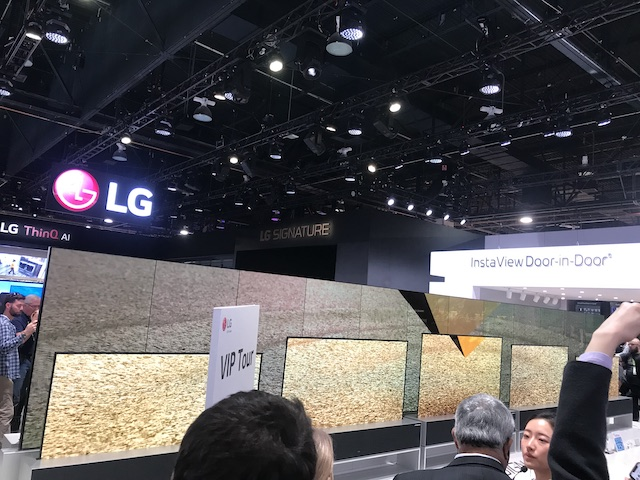 

- Huge display

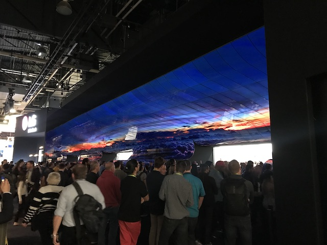 
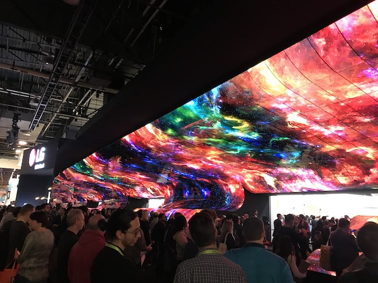 

- Monitor

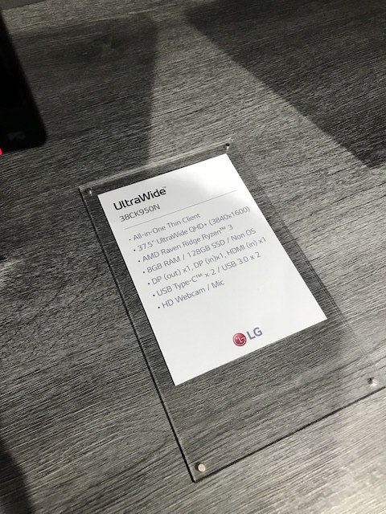 
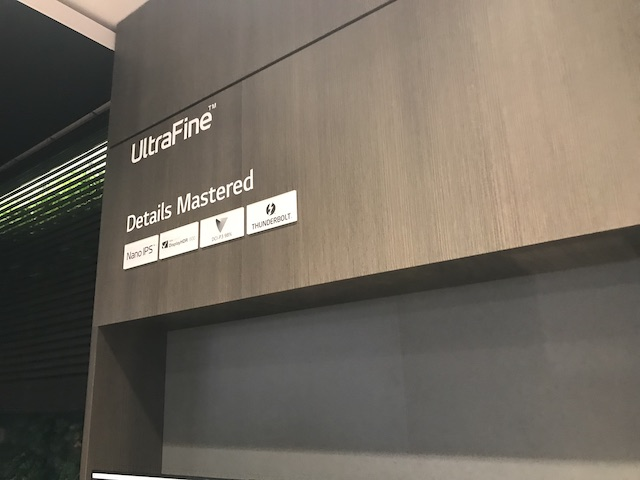 

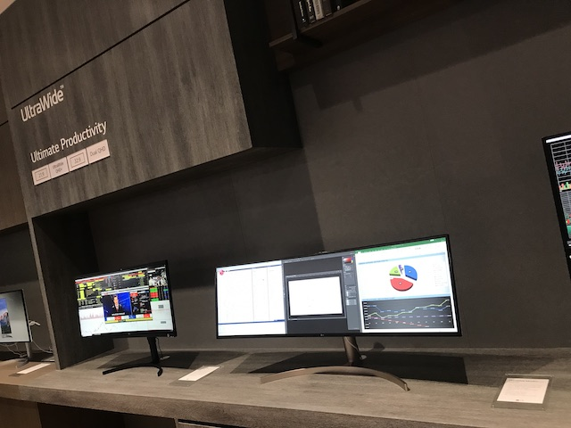 
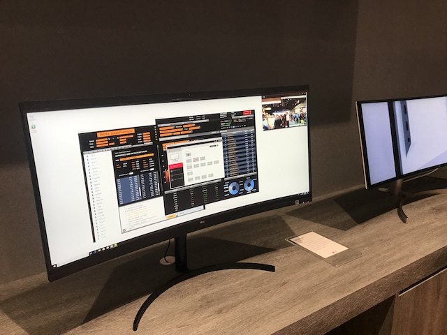 
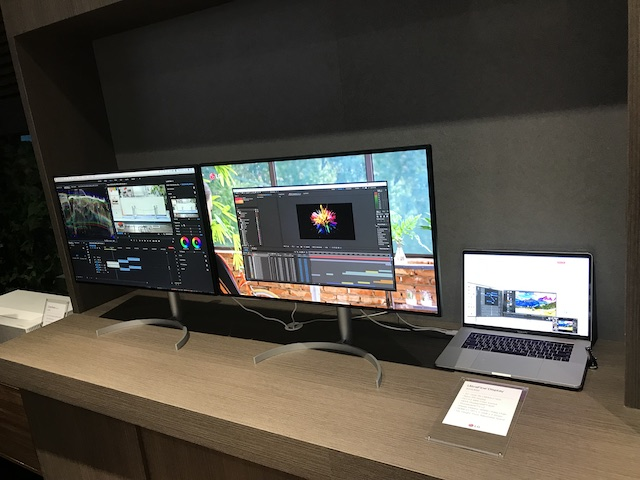 

- Smart Mirror

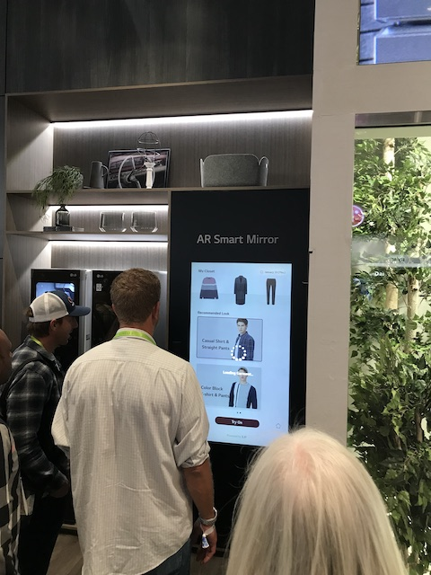 

### SmartPhone
- V40 ThinQ 
The latest model in LG's flagship V series, the LG V40ThinQ, empowers users to channel their inner creator with the best multiple performance cameras and largest OLED display. With a triple-rear camera and dual-front camera, the V40TinQ is the first premium smartphone with five cameras. 
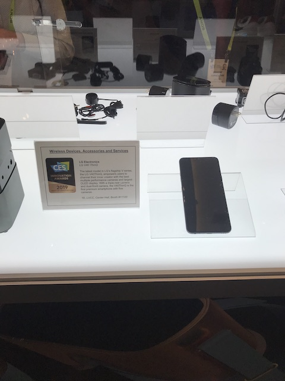

### Robotics
- CLIO

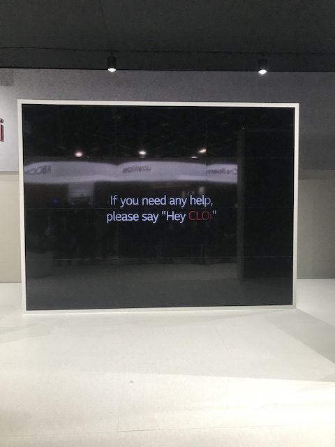 
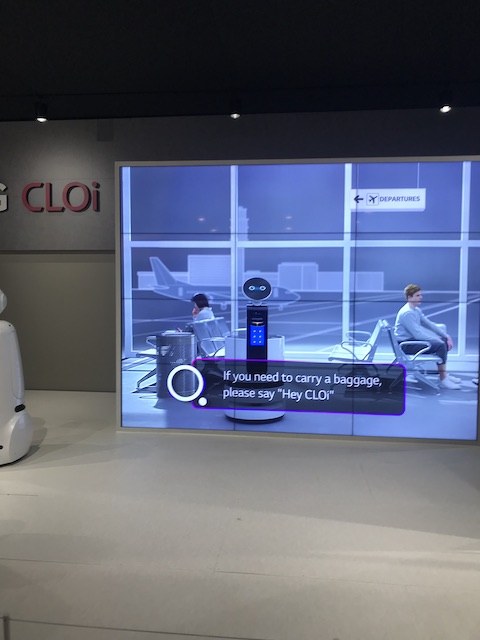 

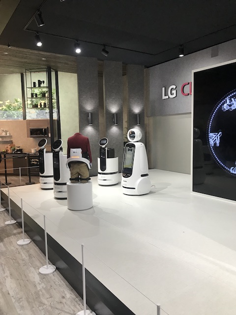 
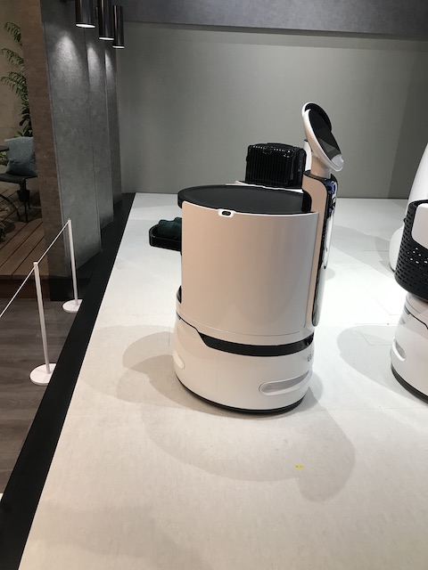 
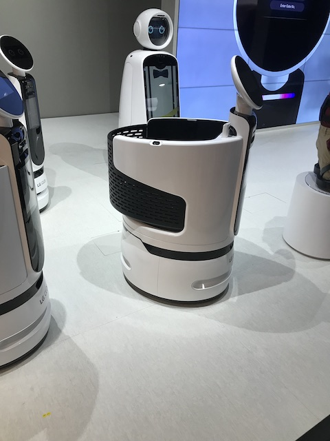 
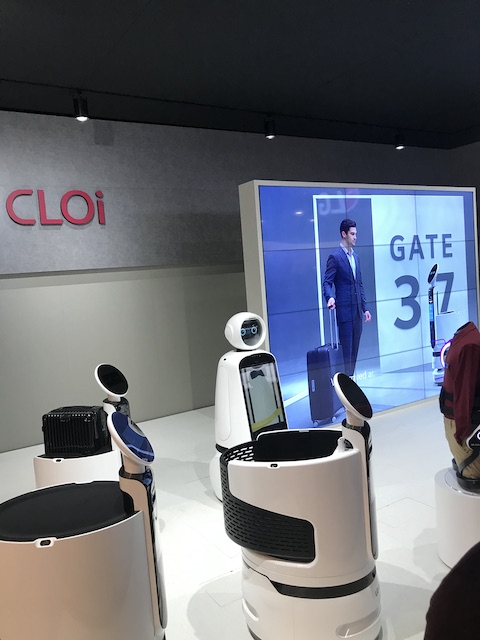 

### Speaker
- XBOOM

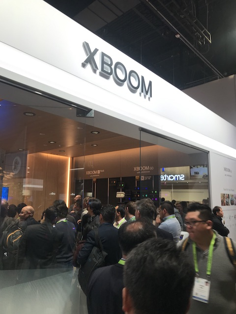 
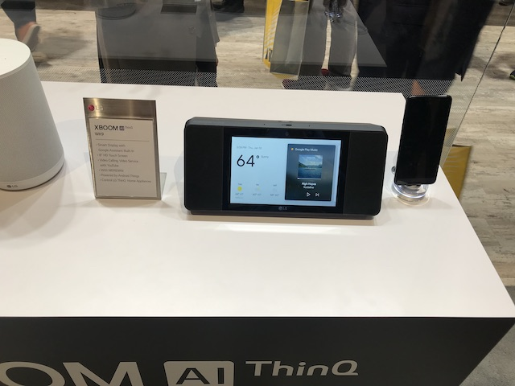 
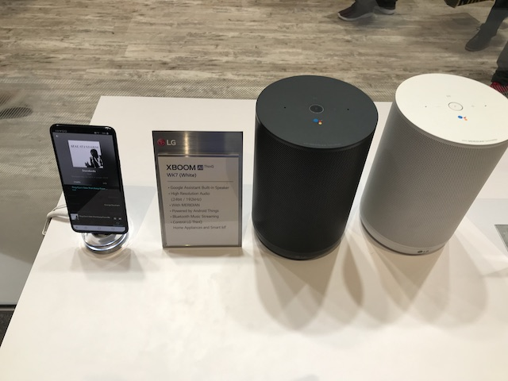 
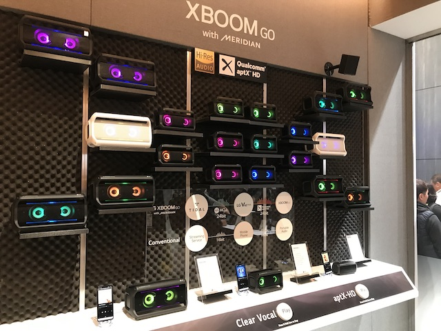 

### Labtop
- 17" Gram 

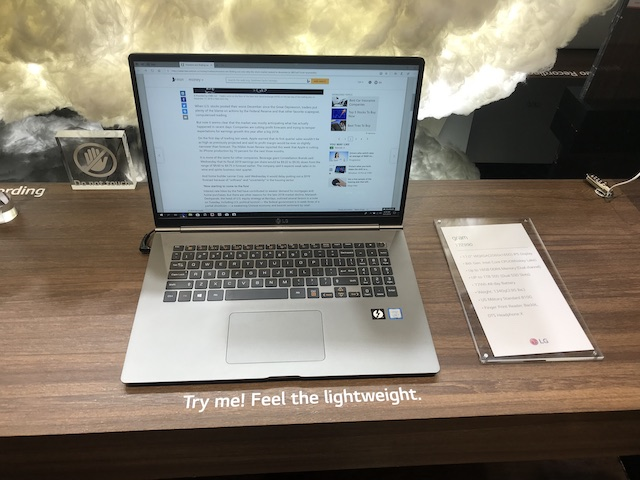 
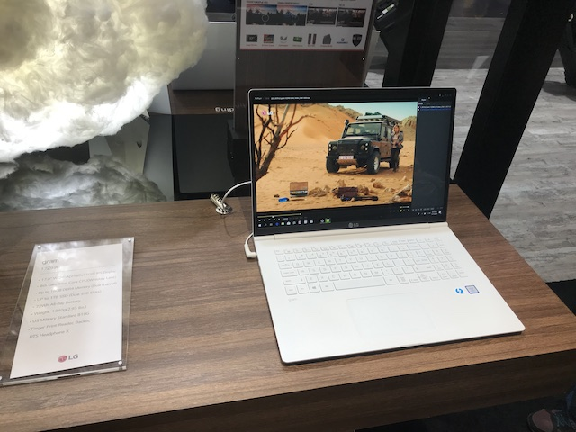 
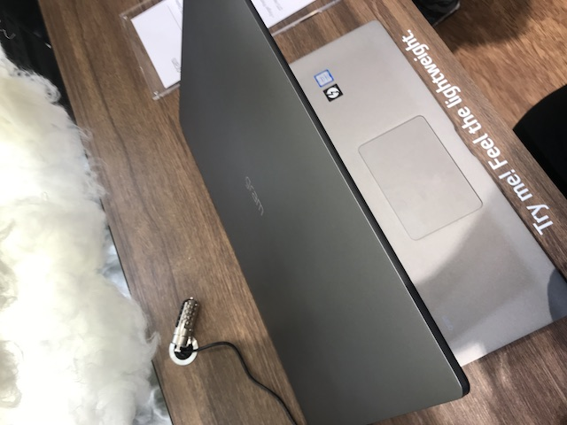 
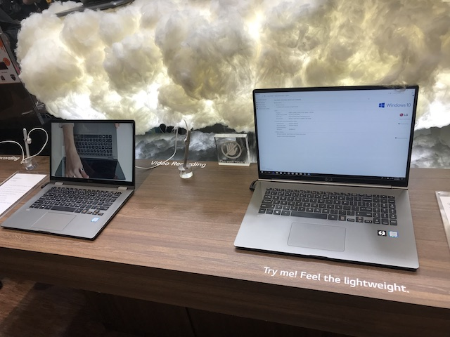 

### My thoughts on the LG booth 
정말 수 많은 사람들이 LG 부스에 있었고 여러 전자 제품을 Rollable TV와 벽, 천장을 감싼 Display는 굉장히 놀랐고 LG가 한국기업이라는 것이 자랑스러울 만큼 신기하고 좋았다. 더 나은 삶을 위한 혁신 이라는 LG Booth 입구의 글귀를 증명이라도 하듯이 많은 혁신적인 기술들을 보았다. 특히 CLIO라는 인천국제공항에서도 실제 사용되는 안내로봇을 공항 뿐 만 아니라 Serving, Delivery 등과 같은 많은 응용을 하는 점이 역시 LG는 LG이다 라는 것을 느끼게 해주었다.
하지만, 아쉬운 점 또한 있다. 너무 Rollable TV, Display같은 화려함만이 강조되어 있어 정말 기술을 보고싶고 어떻게 동작하는지 궁금한 사람들에게는 조금 아쉬운 부분이 있었다 득히 나같은 경우에는 앞서 말했듯이 CLIO라는 로봇이 너무 인상 깊어서 동영상 통해서가 아닌 실제 시연하여 작동하는 것을 눈으로 직접 보고싶었는데 많이 아쉬웠다. (이부분은 나중에 CES가 끝나고 Keynote 영상을 통해 시연영상을 볼 수 있어서 좋았음.)
