# Day03 (2019.01.10, THU)

## Samsung (Welcome to Samsung city)

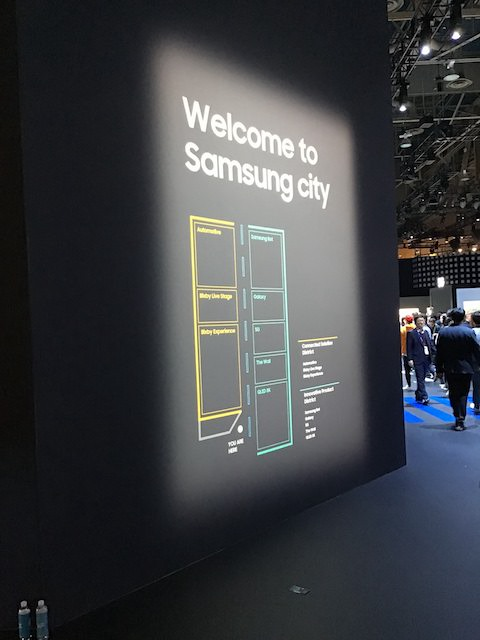 
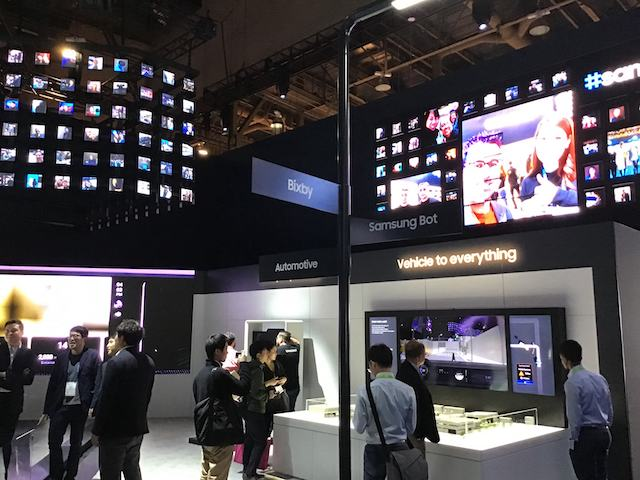 

### Automotive

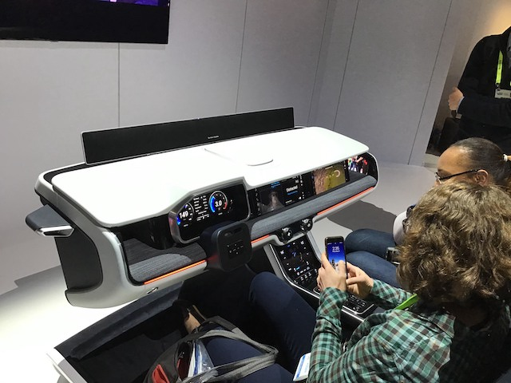 
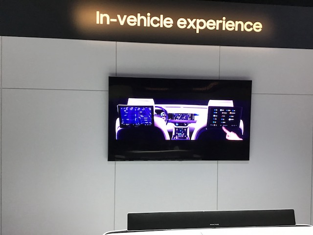 

### Bixby

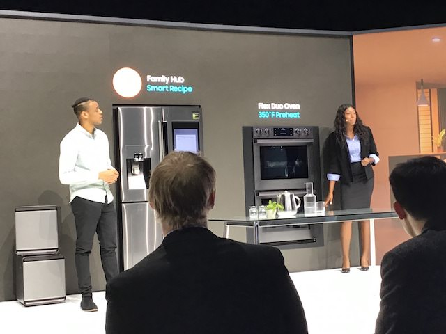 
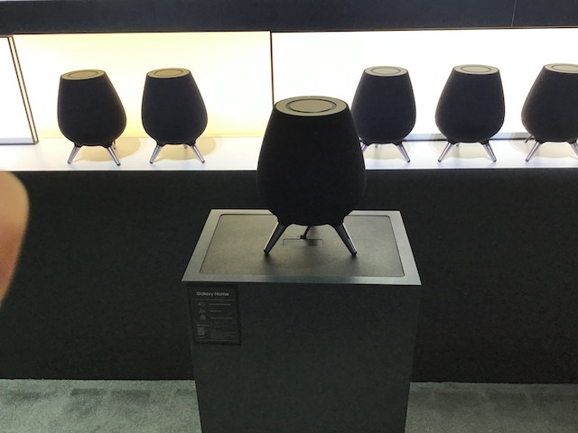 

### Samsung Bot

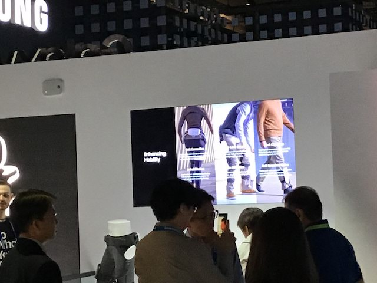 
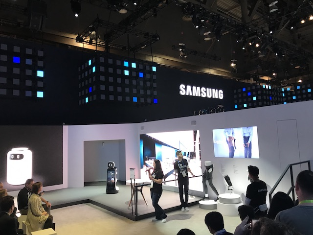 
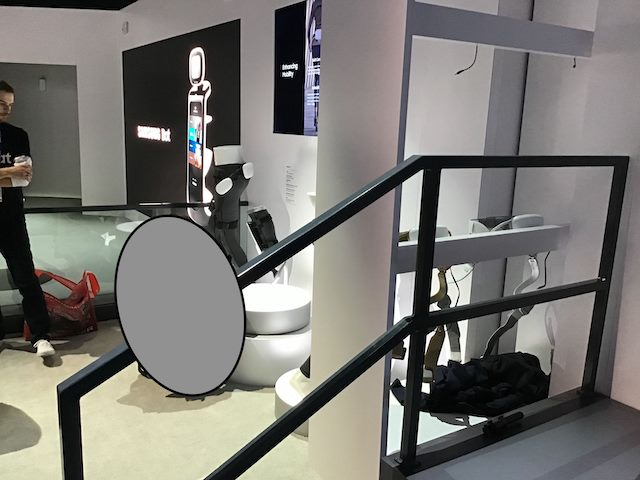 

### Galaxy

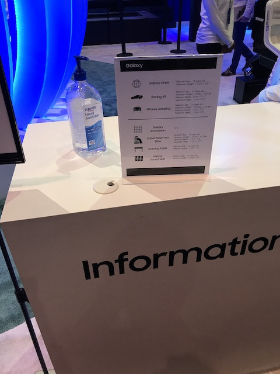 
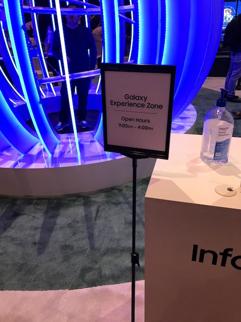 

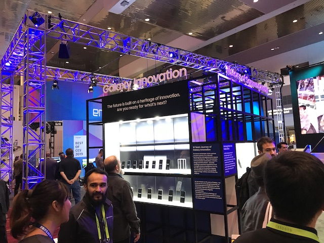 
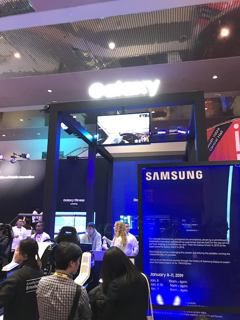 

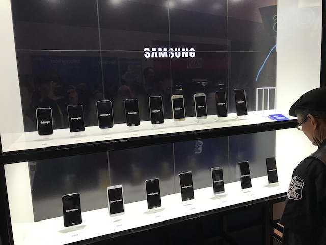 
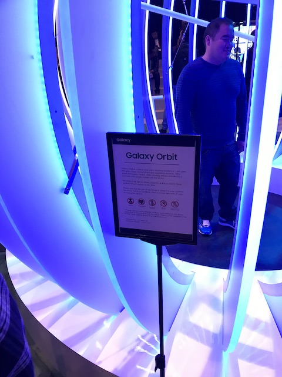 

### 5G
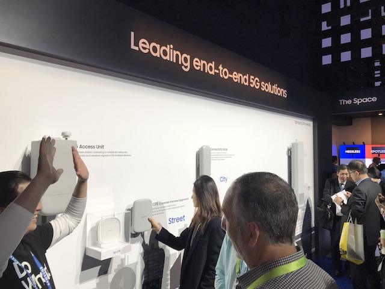 

### The Wall

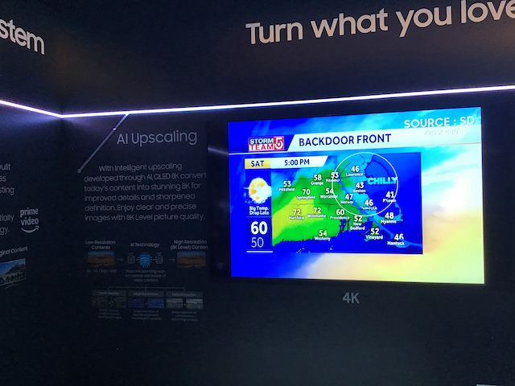 
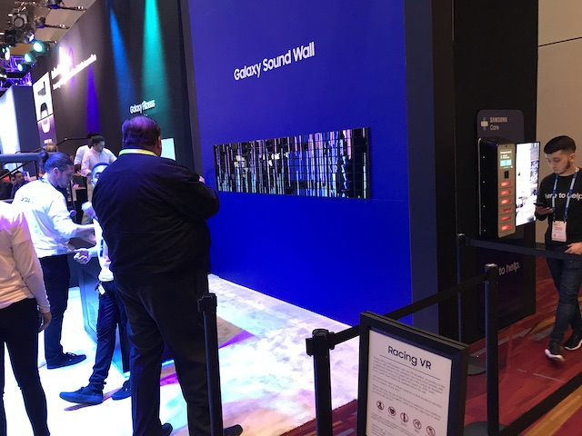 

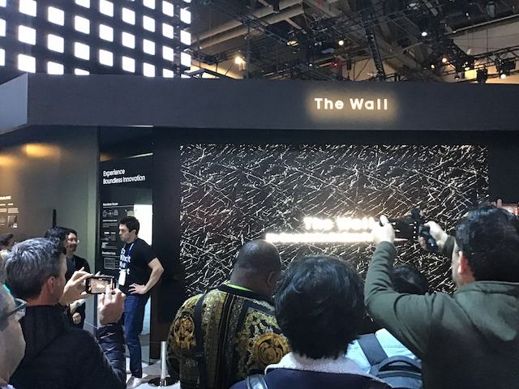 
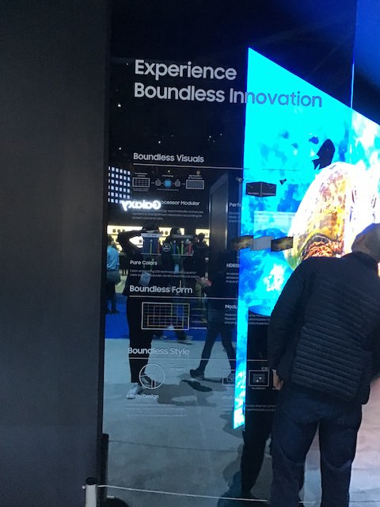 

### QLED 8K

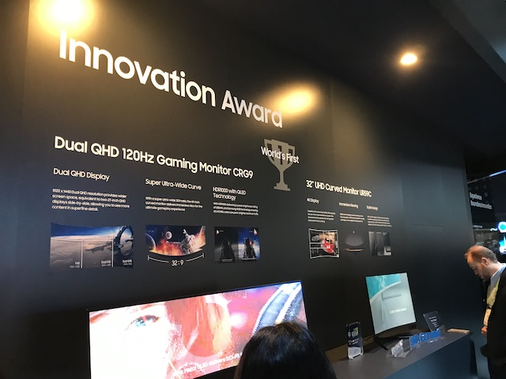 
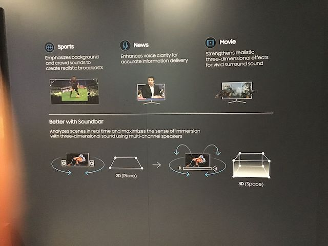 

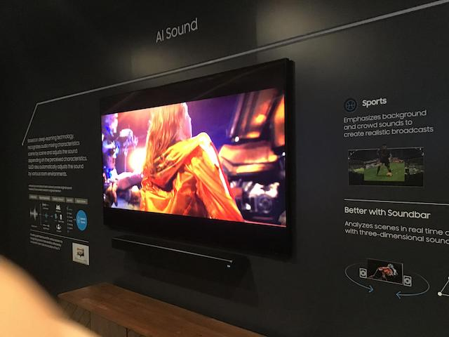 
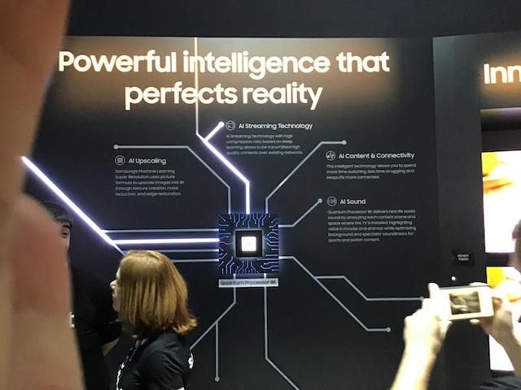 

### Laptop

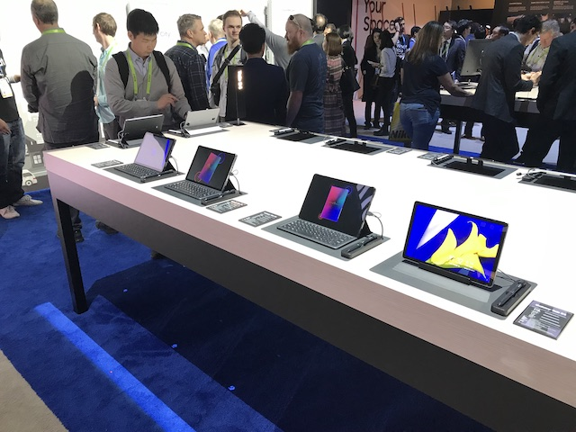 
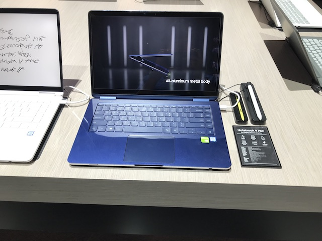 

### My thoughts on the Samsung booth 
Samsung 부스는 엄청 화려하지 않았지만 정말 다양했다. 부스의 테마인 Welcome to Samsung city를 증명하듯 도시 속 모든 것에 Samsung의 기술을 접목시켜서 보여주고 있었다. 정말 천천히 한 번 돌아봤는데 자동차에 내비게이션, Bixby에 연결된 모든 Samsung의 가전제품 및 사용 시연회, 로봇 등 정말 내가 알고 있는 Samsung이 맞나 싶을 정도의 다양한 제품들을 전시하고 있었다.  
그중에서도 Bixby를 통하여 시연회를 하는 것을 봤는데, 정말 잘 만들었다는 생각을 했다. 한편의 CF를 보는 듯한 시연자가 Bixby를 통하여 아침에 출근하고 또 직장에 가서도 사용하고 퇴근하고도 사용하는 그런 10분 정도의 시연회가 가장 인상 깊었다. 이런 시연을 보면 왜 Samsung이 세계 1위의 전자회사 인지를 알 수 있었다.(로봇 또한 시연을 하고 있었다.) 
하지만, 역시 조금 더 아쉬운 부분이 있다면, 약간의 기기의 호환성? 부분을 더 보여줬으면 좋았을 것 같다. 물론 Samsung 부스에서 Samsung의 모든 Device가 연동되어 이렇게 잘 사용할 수 있다는 걸 보여주는 건 당연한대, Samsung 폰이 아닌 폰을 사용하거나 Samsung 가전제품이 아닌 타 회사의 가전제품을 사용하는 사람들에 대한 호환성 부분도 생각했으면 더욱 더 좋았을지 않았을까 생각한다. 
